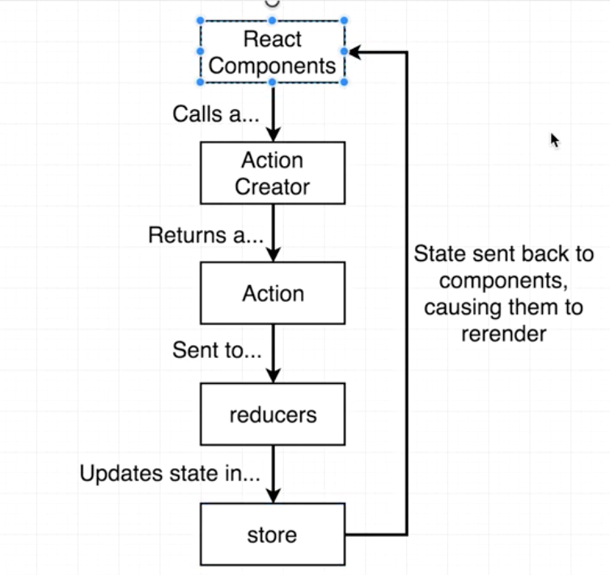

Node React Fullstack

# 3.
Use Prettier to automatically format document on save.

# 11.
You can have multiple express applications running within node application

# 12.
mkdir server
npm init
npm install -g express
create index.js
create .gitignore (add node_modules)
node index.js

4 steps for hekoku
1. Dynamic port binding
2. specify node enviornment i.e. declare engines property it in package.json 
"engines": {
    "node": "8.1.1",
    "npm": "5.0.3"
  }

3. Specify start script i.e. scripts section, add start section
"scripts": {
    "start": "node index.js"
  },

# 14.
Install heroku cli

heroku login
heroku create
git remote add heroku https://REMOTE_URL
git subtree push --prefix server heroku master //git push heroku master --This will push the whole repo, the listed command will only push the server folder
heroku open --opens in the browser
heroku logs
heroku run bash //get access to shell

# 17. 
(client - api call) localhost:500/auth/google -> (Server) google.com/auth?appid=123 -> (google redirects browser) localhost:5000/auth/google/callback?code=456 -> (server) get profile from code -> (google responds) -> (server) record user details -> (client) store user Id in cookie -> (client) redirect to home page

PassportJs helps oAuth - 2 Limitations
- hard to understand flow and big picture
- how library been structured (passport [generic helper functions], passport strategy)

There are 500+ strategies on passportJS. Go to website to find the right one.

# 19.
npm install --save passport passport-google-oauth20

# 20.
http://console.developers.google.com
create app and sign up for google+ Api (not oauth. Doh!!!) -> Create credentials -> Oauth client ID

Authorised JavaScript origins -> http://localhost:5000
Authorised redirect URI's: http://localhost:5000/auth/google/callback

Don't push clientSecret to Github. Create config -> keys.js and add to git ignore.

# 25.
Once successfully logged in, the callback function for the GoogleStrategy will be called with the accessToken.

# 26.
Access token allows us to do stuff with users profile that they have given us access to e.g read emails etc.

Refresh token allows us to update the access token as it refreshes after some time.

# 27. Nodemon Setup
npm install --save nodemon

Pacakge.json -> scripts  -> "dev" : "nodemon index.js"
npm run dev

# 28. Refactor
3 things: config, services and routes

# 30. Signin with oAuth
Store some unique token from the profile. Google allows multiple emails so not a good strategy. Use the user's id provided by google.

# 31. Mongo DB Intro
Mongoose.js optional library that provides useful operations.

Mongoose has Model class. It has bunch of functions assigned to it e.g. creating a record, searching all the records.

# 32. Mongo DB Setup
Hosting Mongo DB remotely https://mlab.com/

# 33. Connecting Mongoose
npm install --save mongoose
mongoose.connect(keys.mongoURI);
You may see warning becuase mongoose need to update their code to bring it inline with MongoDb updates.

# 35. Mongoose Model class
Deconstructing  - const { Schema } = mongoose; //destructing for const Schema = mongoose.Schema;
Mongoose forces us to declare all the properties for a model ahead of time where Mongo Db doesn't have any such restrictions.

Once mongoose is told about the model, it will create an empty collection if it doesn't exist.

# 36. Saving Model Instances
const User = mongoose.model('users'); //fetch user Model instance
new User({ }).save(); //create a user instance and save

# 37. Mongooes Queries
User.findOne({googleId: profile.id}).then(user => { //do something });

# 38. Passport Callbacks
call the done method to let passport know that we are done. First argument of the method should be null if there were no error otherwise an error object.

# 39. Encoding Users
passport.serializeUser is called when the user authenticates.

# 40. Deserialize User
passport.deserializeUser()

This will put the user onto the request i.e. req.user

# 41. Enabling Cookies
npm install --save cookie-session

Extracts cookie data and encrypts and decrypts it. Passport will then pull out the data from the cookie data.

app.use(
  cookieSession({
    maxAge: 30 * 24 * 60 * 60 * 1000, // 30 days
    keys: [keys.cookieKey] //could provide multiple keys which could be used for different cookies
  })
);
app.use(passport.initialize());
app.use(passport.session());

# 42. Testing Authentication
Request Comes in -> Cookie data is decrypted -> passport derserializes the user -> request sent to route handler.

# 43. Logging out
request is attached with .logout() function by passportjs. It will clear the cookies.

# 44 Deeper Dive
app.use() - used to plug in small middleware functions. Order of these methods is very important. These can be used for small subset of routes as well.

req.session - cookieSession takes the data out of cookie and assigns it to session property.
PassportJs looks at req.session for the user data.

Express recommends express-session but we used cookie-session. They accomplish the same thing but do it in a different fashion. The difference is how the data is stored. 
Cookie session -> all session data is within one cookie. 4093 bytes limitation.
Express session -> stores session id on client side cookie and then lookup up the relevant information in the session store on the server side data store e.g. mongo db. Need to get a package for that.

# 45. Dev vs Prod keys
Store keys in environment variables on production server.

# 47. Determining Enviroment
keys.js will be used to load the correct value depending on whether you are in dev or production mode.
Exclude dev.js file.

Heroku automatically set the NODE_ENV to production.
if(process.env.NODE_ENV === "production")

# 48. Heroku Environment variables
Heroku -> select app -> settings -> config variables.

# 50. Fixing Heroku issues
Callback url by google is http instead of https. The google strategy is figuring out the domain name. This issue is that heroku is proxying stuff. The actual server that the code is running on is http and is managed by the load balancer. Two ways to fix it:

1. In passport.js change the callbackURL to be full url and not relative and put the settings in environment variables.
2. set the proxy: true property. Forwarded to google to let it know to trust the proxy.

# Section 6
## 51. React app generation
npm install -g create-react-app
create-react-app client

## 52. Seperate front end server
npm start --run dev server

## 53. Running the client and the server
concurrently package to run both servers at the same time.
npm install --save concurrently

add the following to scripts tag in package.json

    "server": "nodemon index.js",
    "client": "npm run start --prefix client", //go to client directory and run the command.
    "dev": "concurrently \"npm run server\" \"npm run client\""

## 54. Routing stumbling block
Add proxy to api url in client/package.json

"proxy": {
    "/auth/google": {
      "target": "http://localhost:5000"
    }
  }

Restart the servers becuase package.json file changes don't get picked up.

## 55. Beauty of React proxy
Callback url is failing so on google console add http://localhost:3000/auth/google/callback for port 3000 for client.

npm run build --to build the react app

## 56. Why this architecture?
2 Reasons for same domain for api and client:
1. We are using cookies for authentication
2. No CORS issue.

## 57. Async/Await
async/await are there for syntatic sugar for promises to make the code easier to read and understand.

fetch('http://someapi.com/products') --new method in latest browsers

async function fetchProducts() {
  //const res = fetch('http://someapi.com/products').then();
  const res = await fetch('http://someapi.com/products');
  const json = await res.json();

  console.log(json);
}

// alternative for lamda
const fetchProducts = async () => {

}

## 60. Client React Setup
Delete all files from withing client/src folder apart from registerServiceWorker.

Two root files: index.js (bootup logic for react and redux), App.js (single component, rendering layer, React router logic)

npm install --save redux react-redux react-router-dom

## 61. Installing root modules
For components the file name will be Pascal casing e.g. App.js

Node js has support for common js modules so that's what we use require() but Babel has good support for ES6 modules so that's why we use "import * from 'something'" syntax.

## 62. Troubleshooting NPM
Command line error message due to old NPM. I didn't see it because I had the latest version. Author fixed the issue by deleting the package-lock.json file and did 'npm install' again.

## 63. Redux review and setup
Redux - holds the state and data for the application.

                Redux Store (where all the state exists)
                    |
                    ▼
              combineReducers
              |             |
              ▼             ▼
          authReducer    surverysReducer

Two reducers (States) -> authReducer, surverysReducers (surveys created by user)

How redux works
<!-- To change state we use Action creater -> dispacthes actions to all the reducers -> reducers are combined with the combineReducers call which updates the state in our redux store. -->

Provider is provided by react-redux library. Provider is setup with the root compoent so any component can access the Redux store via the provider tag. This then triggers all the UI to change when the state changes.

## 64. The Auth Reducer
Create reducers folder. Create index.js (we call it that becuase referencing directory would automatically look for index.js

## 65. Finishing Reducer setup
Combine the reducers in /client/reducers/index.js file

## 67. React Router Setup
There are three distinct library. 
react-router-dom (for browser)
react-router-native (for react native)
react-router-core (shared between native and dom)

## 68. Route Configuration
<BrowserRouter> tag can only have one child.

## 69. Always Visible Components
Going to /surveys route shows both Landing and Dashboard component. It's becuase Route is trying to match both '/' and 'surveys' both and shows both the components so use exact={true} attribute. We could emit ={true} bit and I guess we could also use an expression.

## 71. Materialize CSS
Javascripts from materialize will not work with React. There is a "react Material UI" but we are not going to use it because to customizing is hard and not the easiest things to work with.

 npm install --save materialize-css

## 72. Webpack with CSS
import css using `import 'materialize-css/dist/css/materialize.min.css'`. We don't have to assign '* from' from it and webpack will automatically include it.

## 73. Header Design
Use http://materializecss.com/ documenation.

Remember use `className` instead of class becuase react likes it like it.

## 74. Current User API
Materialize's undocumented feature is that it requires at least one root element inside of application with `class name of container`. 

Goal is to figure out if the user is logged in when the app starts. 



We need an `action creator` to make a ajax request to get the current user.

## 75. Additional Proxy Rules
npm install --save axios redux-thunk

axios to make ajax calls.
redux-thunk for action creation.

create all the action creaters are in the /actions directory.

add redux thunk as middleware `applyMiddleware(reduxThunk)`.

ES6 import funda. If the file has a deafult export like

```javascript
export default 42 //in A.js
import A from './A'
import Anacoda from './A' //allowed
import Benadroll from './A' //allowed
```

```javascript
export const A = 42  //in A.js

import { A } from './A'
import { myA } from './A' // Doesn't work!
```

```javascript
//A module can only have one default export, but as many named exports as you'd like
import A, { myA, Something } from './A'
import X, { myA as myX, Something as XSomething } from './A'; //to create aliases
```

add new proxy rule to allow api calls.

```javascript
"/api/*": {
      "target": "http://localhost:5000"
    }
```

## 76. Basics of Redux Thunk
React redux without the third party library expects action creator to return an action immediately. The Purpose of redux thunk is to break this rule. Redux thunk gives us direct access to the dispatch function (which redux uses behind the scene to dispatch the actions to all the reducers) and then we can manually dispatch an action. I believe it is good for asynchrounus code.

Redux Thunk  will automatically inspect a method and if it returns a function, it will automatically pass in a `dispatch` function to that returned function.

## 77. Refactoring the App
Refactor app to class based component.

Need to make an ajax request to check if the user is logged in. componentWillMount can  be called multiple times so componentDidMount is prefferable.

## 78. Testing Fetch User
`export default connect(null, actions)(App);` from the App.js and this will assign the actions onto `this.props`. 

## 80. AuthReducer return value
Action dispatched need to be picked up by the AuthReducer.

If getting current user and it took long time then the header may login button which is not what we want. Display spinny circle. Auth reducer should return null if we don't know if the user is logged in or not.

## 81. Accessing state in Header comp
We need to use the `connect` helper. Pass function to connect method that will return the properties that should set onto the component properties.

```javascript
// shorter way to write it
function mapStateToProps({ auth }) {
  return { auth };
}

/*function mapStateToProps(state) {
  return { auth: state.auth };
}*/

export default connect(mapStateToProps)(Header);
```

We can even use deconstructing for the parameters that are coming in into a function.

## 83. Redirecting a user after Authentication
We get an error after authentication because passportjs authenticates but doesn't know where to redirect the user to. Pass in the third param to /auth/google/callback route and this will make the second parameter a middleware call.

## 84. Redirect on logout
We need to redirect to /logout because we want to clear the cookies.

## 85. Landing Component

Ways to create a component:

```javascript
const Hello = () => <h1>Hello World</h1> //or const Hello = () => {return <h1>Hello World</h1> }
export default Hello;
```

```javascript
import React from 'react';
class Hello extends React.Component {
  render() {
    return (<h1>Hello World</h1>);
  }
}
```

Styling: (first curly brace is to say it is javascript) `<div style={{textAlign: 'center'}}>` and the second curly brace signifies object.

## 86. Link Tags
`Link` tags should be used to navigate within the app i.e. internal routing. Use <a> tags for normal navigation.

```javascript
import { Link } from "react-router-dom";

<Link
  to={this.props.auth ? "surveys" : "/"}
  className="left brand-logo"
>
  Emaily
</Link>
```

## 88. Billing Consideration
We will use Stripe. With monthly plans, life gets complicated e.g. the customer has used 400 surveys and they want to ugrade to the second tier plan which allows 1000 surveys. How would we do that? Try to avoid montly payment setup. So that's why we are using credits. 

Recurly is a service that allows recurring i.e. monthly subscriptions. It as a charge an no free tier. It is built on top of Stripe so we can still use that.

## 90. Exploring the Stripe API
Strip has many flows. We want to create API key. We are going to use `stripe checkout` library to make use of strip library and we are going to use `stripe checkout react`.

`npm install --save react-stripe-checkout`

## 91. Stripe Api Keys
Add stripe keys to dev.js and heroku env variables.

## 92. Env key with react
We don't want to publish our dev key into the source code so we need to make use of create-react-app's Custom environment variables and also they might be different for developement and production.  We will use process.env.KEY to store our keys.

`REACT_APP_SECRET_CODE=adsdfasdf` for setting on a mac. For windows and other OS's the way is different. 

The react vaiables must being with the prefix `REACT_APP_`.

or we can make .env (and .env.local, .env.dev, .env.prod) files at the root of our project. The key is public anyway but we may to protect the abuse that we might get from publishing it into github and if that is the reason then we should make sure that it is not in the source control. 

```javascript
console.log("stripe key", process.env.REACT_APP_STRIPE_KEY);
console.log("environment", process.env.NODE_ENV); //React automatically sets these.
```

## 93. The Payments component
Create Payments comonent wrapping the StripeCheckout component. By default US is the currency for stripe.

Amount passed to StripeCheckout component is in cents.  Token property is the callback function after the payment is made.

## 94. Stripe Tokens

Returned array of elements instead of just one element

```javascript
default:
        return [ //notice this
          <li><Payment /></li>,
          <li><a href="/api/logout">Logout</a></li>
        ];
```

Test card number `4242 4242 4242 4242`. 

There are fraud prevention apis that help to deal with fake ips. 

## 95. Payment Fixes

There was a warning about the key id by header js.

```javascript
default:
        return [ //notice this
          <li key="1"><Payment /></li>,
          <li key="2"><a href="/api/logout">Logout</a></li>
        ];
```

## 99. Creating Charges
npm package for backend stripe api. Stripe offers a lot of services but we are interested in the charges resource.

`npm install --save stripe`

## 100. BodyParser Middleware
Gotcha with express. POST request, express by default doesn't parse the data. We need middleware for that.

`npm install --save body-parser`

`app.use(bodyParser.json());`

this will update the req.body property.

## 101. Creating a Charge Object
Handle the token at the /api/stripe endpoint

## 103. Add credits to a user
Update the mongoose schema in the User.js model.

Create a new property with defaut value `credits: {type: Number, default: 0}`

## 104. Requiring authentication
Only allow authenticated users to make calls to certain endpoints.

## 105. Route specific middleware
Reminder. For files that return function, the filename will be camel case but for component or model it will be pascal case.

```javascript
//requireLogin.js middleware
module.exports = (req, res, next) => {
    //next is a function that is called when middleware is done
    if (!req.user)
      return res.status(401).send({ error: "You must log in!" });
};

//in billingRoutes.js, we are passing in requireLogin
app.post("/api/stripe", requireLogin, async (req, res);
```
## 106. Displaying Credit quantity
added styles using `<li key="3" style={{ margin: "0 10px" }}>`

## 107. Updaing Credits
The credits automatically update due to the redux framework that we have already set up. This causes the react components to automatically udpate.

# Section 9: Back End to Front End Routing In Production

## 108. Express with Client Web App in production
cd client
`npm run build` for production

Challange, how does the express server tells the difference between the call to api endpoint e.g. /api/stripe and react app path e.g. /surveys. We have to make an assumption that 

## 109. Routing in Production
Add code to express api when running in production.

```javascript
if (process.env.NODE_ENV === "production") {
  //if a request that comes in and express doesn't know how to handle it then
  //it will look in this folder.
  app.use(express.static("client/build"));

  //becuase react has html5 user friendly urls, this will be a catch all if
  //we dont understand how to handle the request
  app.get("*", (req, res) => {
    res.sendFile(path.resolve(__dirname, "client", "build", "index.html"));
  });
}
```

## 110. Deployment Options
We have 3 options.

1. Build client locally and send to heroku. This breaks convention.
2. Push to Heroku and get Heroku to build for us. (This would mean we will have to get all dependencies i.e. Webpack, Create-React-App. Some people don't like it but the dependencies dont get used after we are done so it's no big deal).
3. Push to CI. It run tests and does CI build and push to Heroku. CircleCI can be used for that.

## 111. Adding in a Heroku Build Step
Push to heroku
      |
Heroku install server deps
      |
Hero runs 'heroku-postbuild'
      |
We tell heroku to install client deps
      |
Heroku to run 'npm run build'

On heroku look for documentation 'Heroku Node.js Support' -> 'Customising build process'. Instead of adding a postinstall under script, we will use heroku-postbuild flag becuase we don't want other devs to automatically run these scripts when they get the project. We only want this on heroku.

`heroku config:set NPM_CONFIG_PRODUCTION=false` to get dev depenencies. We need to make sure that it only affects the client side project.

`"heroku-postbuild": "NPM_CONFIG_PRODUCTION=false npm install --prefix client && npm run build --prefix client"` --prefix flag to only run npm install in client folder.

## 112. Testing Deployment

# Section 10 Mongoose for Survey Creation

## 113. Survey Overview

## 114. Server Routes

## 115. Survey Model

```javascript
const surveySchema = new Schema({
  title: String,
  body: String,
  subject: String,
  recipients: [String] //declaring array like so
});
```

## 116. Model Deficiencies
Duplicate votes by the same user. So we will use subdocument collection with email and clicked property.

## 117. Limitations of Subdocument Collection
Why are we limiting the nesting and not putting surveys under the User as subcollection.

Mongo db size limit is 4mb per record. So if we had surveys under the user then we will run out of disk space.

## 118. Setting up SubDocs

## 119. Relationship Fields

```javascript
const surveySchema = new Schema({
  title: String,
  _user: { type: Schema.Types.ObjectId, ref: "User" } 
  //relationship to a user instance
  //prefix of underscore is not required but we could use it to make it clear it is a relationship (convention)
});
```

## 120. Survey Creation Route Handler

## 121. Verifying Minimum Credits
Created requireCredits middleware.

## 122. Creating Surveys

## 123. Creating Subdoc Collections

## 124. Oops! A little Tweak

## 125. Creating Mailers

## 126. Identifying Unique Users
Sendgrid hijacks all the link within our email and when the users click it, it goes to sendgrid server and we will use a webhook to receieve the notification and the link that they clicked on.

## 127. Sendgrid Setup
Create Full Access Api key.

`npm install --save sendgrid`

## 128. Mailer Setup
Mailer will be a service and it starts with capital letter because it exports a class.

## 129. Mailer in Use
Create `emailTemplates` folder in services and create a `surveyTemplate.js` file which will take a survey argument and return a nicely formatted email template.

## 130. Mailer Constructor
Populated Mailer.js with code for constructor. Pretty much follow the code convention that SendGrid has set in their documentation.

## 131. Boilerplace for Sending Emails

## 132. More Mailer Properties
SendGrid code to write is nasty. Alternative is MailChimp to look at.

## 133. Sending SendGrid Emails

## 134. Testing Email Sending

## 135. Improving the Email Template

## 136. Polish in the Route Handler
Remove credits from the user on sending email and add try catch block

## 137. Verifying Sendgrid Click Tracking

## 138. Feedback for User Feedback
Added redirectDomain key to make it configurable.

# Section 11. Back to the Client